# Invoice Intake

Reads Japanese supplier invoices, extracts them into structured data, verifies the numbers, and
registers them into the accounting system through its API — with a review screen in front of the
irreversible step.

## Contents

- [1. Quick start](#1-quick-start)
- [2. How this app works](#2-how-this-app-works)
  - [2.1 The pipeline](#21-the-pipeline)
  - [2.2 Upload](#22-upload)
  - [2.3 Reading](#23-reading)
    - [2.3.1 PDF with a text layer](#231-pdf-with-a-text-layer)
    - [2.3.2 Scan, photo, or image-only PDF](#232-scan-photo-or-image-only-pdf)
    - [2.3.3 Model fallback](#233-model-fallback)
  - [2.4 The accounting system connection](#24-the-accounting-system-connection)
    - [2.4.1 What is fetched](#241-what-is-fetched)
    - [2.4.2 Matching the supplier](#242-matching-the-supplier)
    - [2.4.3 Using the tax codes](#243-using-the-tax-codes)
    - [2.4.4 Registering](#244-registering)
  - [2.5 Verification](#25-verification)
  - [2.6 Blocked](#26-blocked)
    - [2.6.1 A failed check](#261-a-failed-check)
    - [2.6.2 Duplicates](#262-duplicates)
  - [2.7 Review and revalidate](#27-review-and-revalidate)
  - [2.8 Registered](#28-registered)
- [3. Project layout](#3-project-layout)

---

## 1. Quick start

Requires **Python 3.10 or newer. Nothing else.** No Node.js, no `pip install`, no Docker.

```
python run.py
```

Then open <http://localhost:8000>.

One command creates `.venv` and installs dependencies (first run only), starts the accounting system
on port 8080, and serves this app on port 8000. If port 8080 is already answering, that instance is
left alone.

Create a `.env` file next to `run.py`:

| Key | Purpose |
|---|---|
| `OPENROUTER_API_KEY` | The reader. Free models are used, so a free account is enough. |
| `GEMINI_API_KEY` | Optional. Tried first, and used as the last resort when OpenRouter is rate-limited. |
| `ACCOUNTING_API_KEY` | `demo-key-1234` — the key the assignment publishes. |

Without a model key the app still runs: text-layer PDFs are read locally, and scans are held for a
human with that reason shown on screen.

---

## 2. How this app works

### 2.1 The pipeline

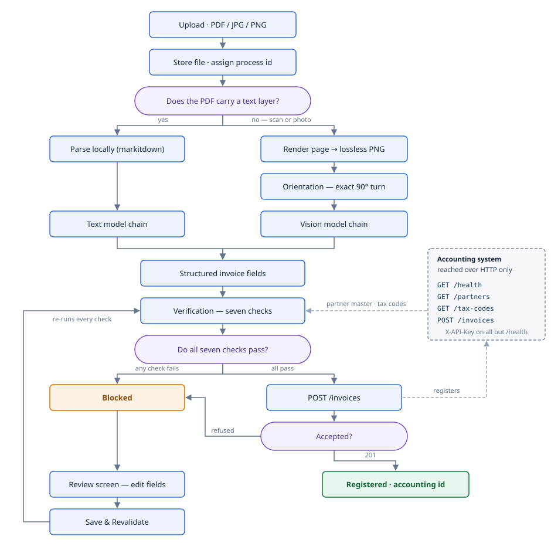

Reading runs on a background worker, so the queue stays usable while models are working. Every
document keeps one process id from upload to registration.

### 2.2 Upload

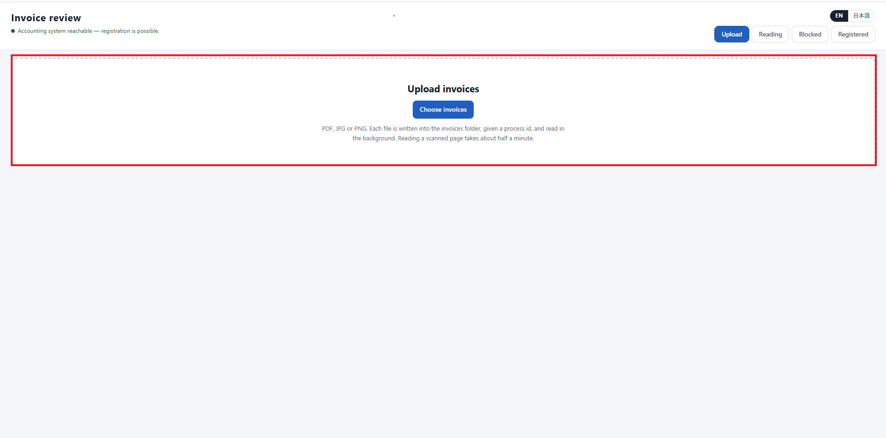

Accepts `.pdf`, `.jpg`, `.jpeg` and `.png`, several files at a time. Each file is copied into the
invoices folder, given a process id, and queued. The upload returns immediately.

### 2.3 Reading

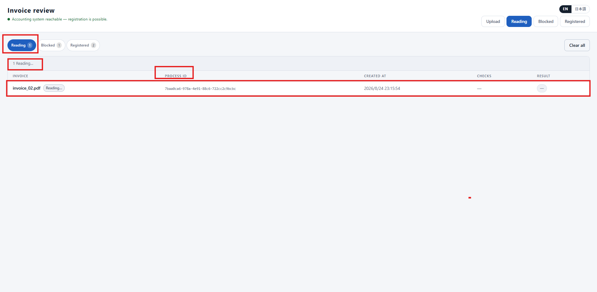

The **Reading** tab lists documents currently being read. How a file is read depends on what it is.

#### 2.3.1 PDF with a text layer

Parsed locally with markitdown into Markdown, then a text model turns that Markdown into fields. No
vision call, no image rendering. Under a second per document.

#### 2.3.2 Scan, photo, or image-only PDF

Each page is rendered to a lossless PNG, straightened, and sent to a vision model.

Straightening is an exact 90° rotation, so no pixel value changes. It uses Tesseract when installed;
without it, pages pass through untouched and everything else still works.

Roughly half a minute per page.

#### 2.3.3 Model fallback

Models are tried in order and the first usable answer wins. A rate limit, a timeout, or an empty
answer moves to the next model instead of failing the document. The model that answered is recorded
with its input and output token counts, shown on the review screen.

### 2.4 The accounting system connection

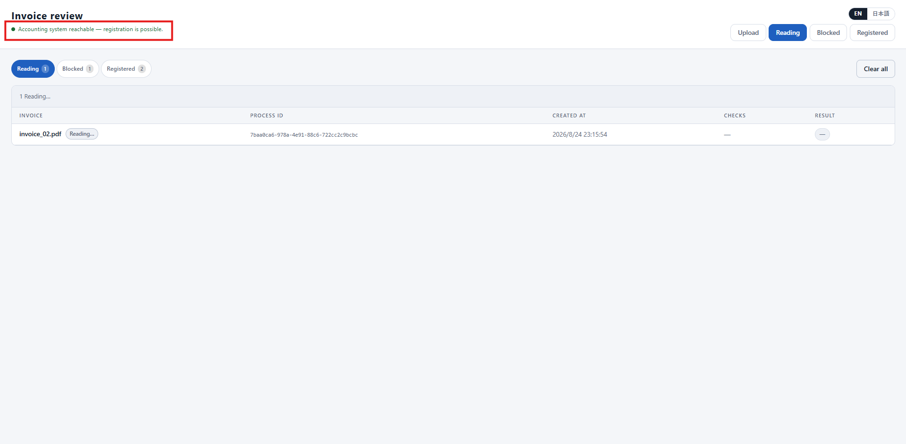

The header shows whether the accounting system is answering. If it is not, nothing is registered —
documents queue and wait.

The app never imports or launches `accounting_api.py`. It is treated as a separate system on another
server and reached over HTTP only, with `X-API-Key` on every call except `/health`.

#### 2.4.1 What is fetched

| Call | What comes back | What it is used for |
|---|---|---|
| `GET /health` | liveness | The header indicator; gates registration |
| `GET /partners` | `partner_code`, `name`, `aliases`, `registration_no` | Matching the supplier printed on the invoice |
| `GET /tax-codes` | `tax_code` and `rate` (`T10` = 10%, `T08` = 8%) | Recomputing tax and rejecting unknown codes |
| `POST /invoices` | `accounting_id` | Registering the invoice |

The partner master and tax codes are cached for 60 seconds and refreshed on demand. If either cannot
be read, the supplier check fails with the reason stated — an unreachable system or a rejected API
key — rather than silently passing.

Every response uses the assignment's envelope. A returned `error.code` is stored on the document with
its HTTP status and shown to the reviewer.

#### 2.4.2 Matching the supplier

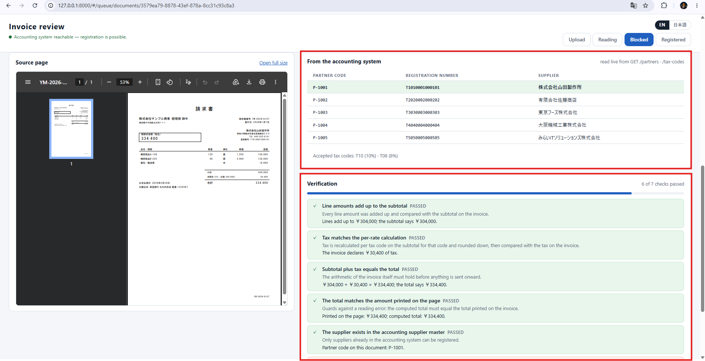

The partner master is shown next to the checks, with the matched row highlighted, so a reviewer can
see what was matched against. Matching is tried in this order and stops at the first hit:

1. **Registration number** (登録番号, `T` + 13 digits) against `registration_no`.
2. **Partner code** against `partner_code`.
3. **Printed supplier name** against `name` and `aliases`, after normalising full-width characters to
   ASCII, removing whitespace, and case-folding. An exact match wins; otherwise a containment match
   is accepted only when exactly one partner matches.

On a match the master's `partner_code` replaces whatever was extracted, so the value sent onward is
always the accounting system's own.

#### 2.4.3 Using the tax codes

The fetched rate table drives two things: any line carrying a code that is not in the table fails,
and tax is recomputed as `floor(subtotal_for_code × rate)` per code — the same round-down rule the
accounting system applies.

#### 2.4.4 Registering

The request is built from the document's fields. `quantity` and `unit_price` may be null; everything
else must be present. A `201` returns an `accounting_id`; any error code is recorded and the document
returns to the queue.

### 2.5 Verification

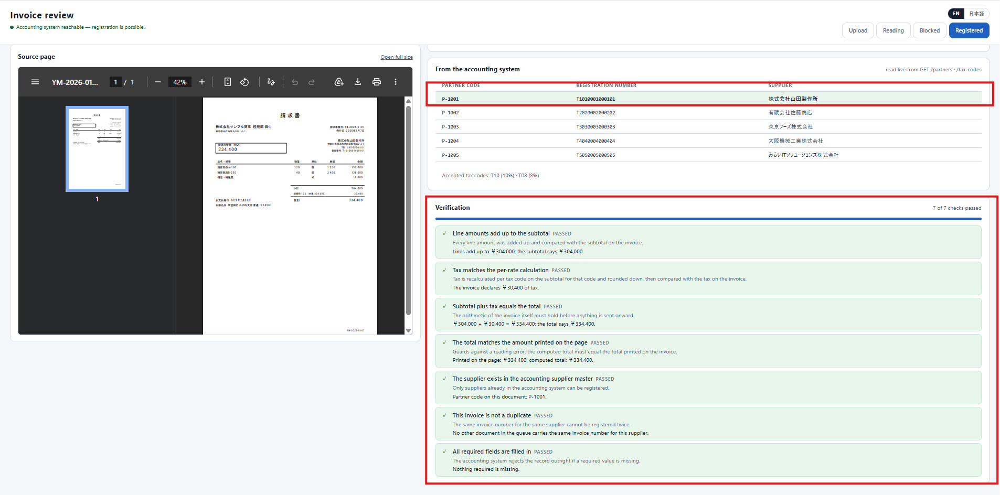

Seven checks run on every extraction and on every correction. All seven must pass before anything is
sent onward.

| # | Check | What it protects against |
|---|---|---|
| 1 | Line amounts add up to the subtotal | A misread digit in any line |
| 2 | Tax matches the per-tax-code recalculation | Getting tax wrong on a mixed 10% / 8% invoice |
| 3 | Subtotal plus tax equals the total | Arithmetic that does not hold internally |
| 4 | The total matches the total printed on the page | A total invented by the model |
| 5 | The supplier exists in the partner master | Registering against a partner that does not exist |
| 6 | This invoice is not a duplicate | Paying the same invoice twice |
| 7 | All required fields are filled in | An outright rejection from the accounting system |

Checks 1–3 reproduce the accounting system's own arithmetic locally, so numbers that would be
rejected are never sent. Check 4 is the one aimed at AI error specifically: every other check can be
satisfied by numbers that are internally consistent but simply not the ones on the paper.

When all seven pass, the invoice is registered automatically — no button, no confirmation.

### 2.6 Blocked

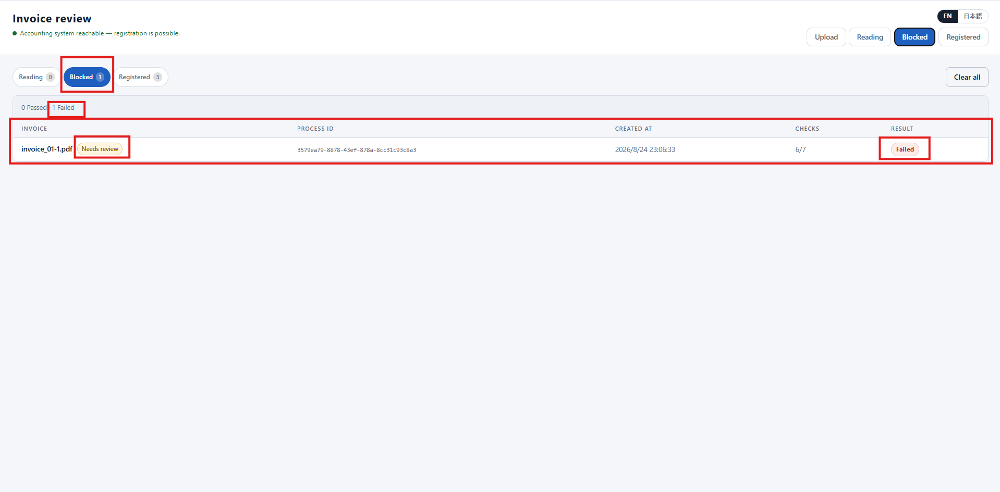

A document that fails any check goes to **Blocked** and stops there. The tab shows the score at a
glance, here `6/7`.

#### 2.6.1 A failed check

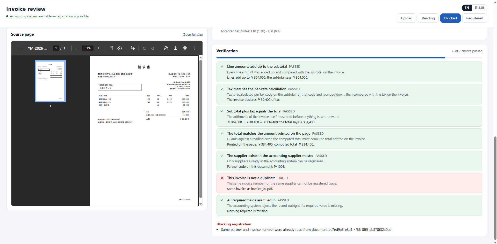

Each check states its result, what it protects against, and the numbers it used. Failures are
repeated under **Blocking registration**.

#### 2.6.2 Duplicates

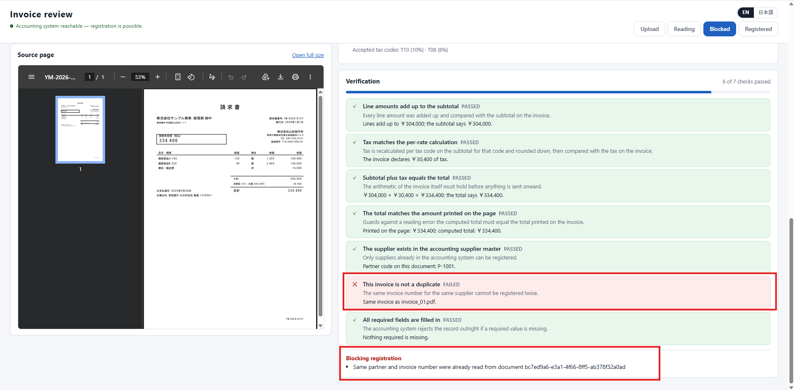

Duplicates are caught before registration, by partner code plus invoice number, and the earlier
document is named.

### 2.7 Review and revalidate

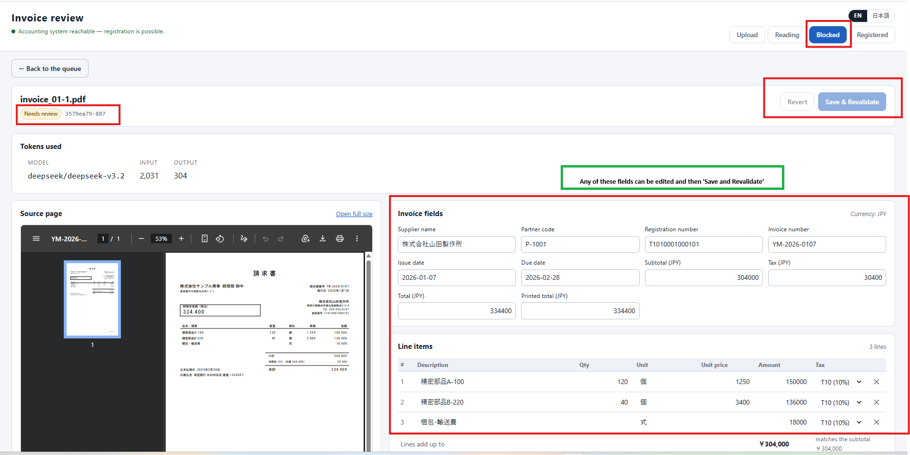

The source page sits on the left and the extracted data on the right, so the reviewer reads the paper
and fixes the data without switching windows.

| Area | Contents |
|---|---|
| Source page | The original PDF or image, zoomable, with a full-size link |
| Invoice fields | Supplier, partner code, registration number, invoice number, dates, subtotal, tax, total, printed total |
| Line items | Description, quantity, unit, unit price, amount and tax code per line; lines can be edited or removed |
| Tokens used | Which model answered, and its input and output token counts |

**Save & Revalidate** writes the correction and re-runs all seven checks on the server. **Revert**
discards the edits. Correcting a field never re-reads the document and never spends another token,
and the document id is kept.

The outcome is the same as a first read: all seven pass and it registers, or it returns to **Blocked**
with the remaining failures listed.

### 2.8 Registered

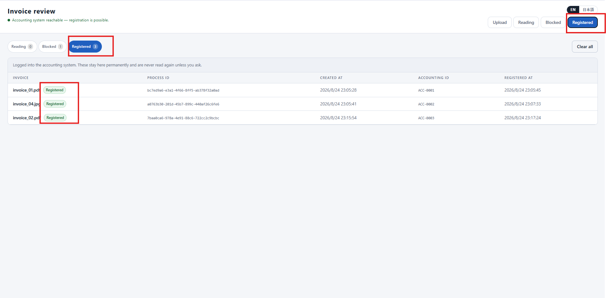

Registered documents show the `accounting_id` returned by the accounting system and the time it was
accepted, and stay listed permanently.

Registration is one-way. The accounting system has no update and no single-record delete, so a
registered document cannot be edited, re-read, or sent again. A lock around the registration step
prevents two workers registering the same document twice.

---

## 3. Project layout

```
backend/
  app.py               builds the application
  settings.py          every path, url, model name and threshold
  controllers/         the HTTP endpoints
  core/                models, prompts, and the domain knowledge the agent uses
  repositories/        persistence (SQLite)
  services/
    document_service.py     upload, background reading, registration
    validation/             the seven checks
    accounting_service.py   HTTP client for the accounting system
    extraction/             orientation, transcription, model chain
frontend/              review screen (React); dist/ is the built output the backend serves
public/
  storage/             the invoice files
  database/            the SQLite database
run.py                 the single entry point
accounting_api.py      the client's accounting system, verbatim from the assignment; not our code
```

`accounting_api.py` is the block from section 8 of the assignment, copied in byte for byte. Nothing
here modifies it.

`frontend/dist/` is committed on purpose so the project runs without a Node toolchain. To rebuild it:
`cd frontend && npm install && npm run build`.

The interface is English and Japanese, switchable in the header and remembered between visits. Every
visible string comes from one dictionary; no component contains hard-coded text.
